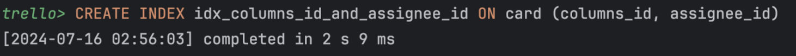
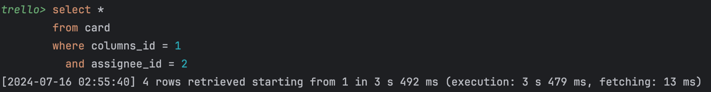
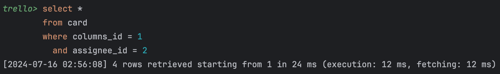
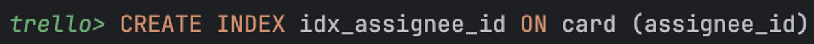
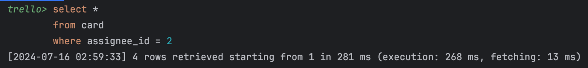
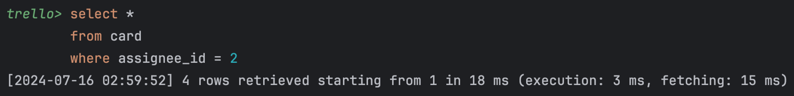

# 🐺Work-Flow

## 🖥️ 프로젝트 소개
- 한 줄 정리 : 협업의 흐름을 한번에 파악 가능한 칸반 보드 서비스
- 내용 : 보드를 사용하여 작업의 흐름을 정리하고 협업을 좀 더 효율적으로 만들어주는 엄청난 서비스입니다.

## 🕰️ 개발 기간
* 24.07.10일 - 24.07.16일

### 🧑‍🤝‍🧑 맴버구성
- 팀장  : 류정근 - 카드CRUD , 프론트
- 팀원 : 석현호 - 보드CRUD , Notion,Readme 정리
- 팀원 : 임애림 - 컬럼CRUD , 발표자료(PPT)
- 팀원 : 서찬원 - 시큐리티 및 USER , 쿼리 최적화
- 팀원 : 양소영 - 댓글CRUD , 프론트 , 발표

### ⚙️ 기술 스택

| Type      | Tech                                                                                                                                                                                                                                                                                                                                                |
| ---------- |-----------------------------------------------------------------------------------------------------------------------------------------------------------------------------------------------------------------------------------------------------------------------------------------------------------------------------------------------------|
| IDE        |                                                                                                                                                                                                                        |
| Framework        |                                                                                                                                                                                                                                     |
| Langage      |          |
| Database   |                                                                                                                                                                                                                                               |
| Tools   |                                                                                                                                      |

##  📩 Commit Rule

> ex)  
> [#1] ✨ feat : 초기 세팅

| 작업 타입       | 작업내용            |
|-------------|-----------------|
| ✨ feat      | 없던 파일을 생성, 초기세팅 |
| 🐛 Fix      | 버그 수정           |
| ♻️ Refactor | 코드 리팩토링         |
| 🍻 Test      | 테스트 코드를 작성      |

##  ❗ Code Convention

Code Convention

||
|:---:|:---:|
|||

##  와이어프레임

## ERD

## 최적화
- 프로그램 성능을 높이기 위해 시도한 것

### 쿼리 최적화

예시 1) 컬럼 ID + 담당자 ID 해당하는 카드 조회

- 환경 : 400만 카드 데이터
- 찾은 데이터 수 4 row
- 조건 : 컬럼 ID + 담당자 ID
- 최적화 방법 : 인덱싱

- 비교 : 
- 최적화 전

- 작업 시간 **3s 492 ms**
- 최적화 후

- 작업 시간 **24ms**
- 

예시 2) 담당자 ID로 해당하는 카드 조회

- 환경 : 400만 카드 데이터
- 찾은 데이터 수 4 row
- 조건 : 담당자 ID
- 최적화 방법 : 인덱싱

- 비교 :
- 최적화 전

- 작업 시간 **281 ms**
- 최적화 후

- 작업 시간 **18ms**

